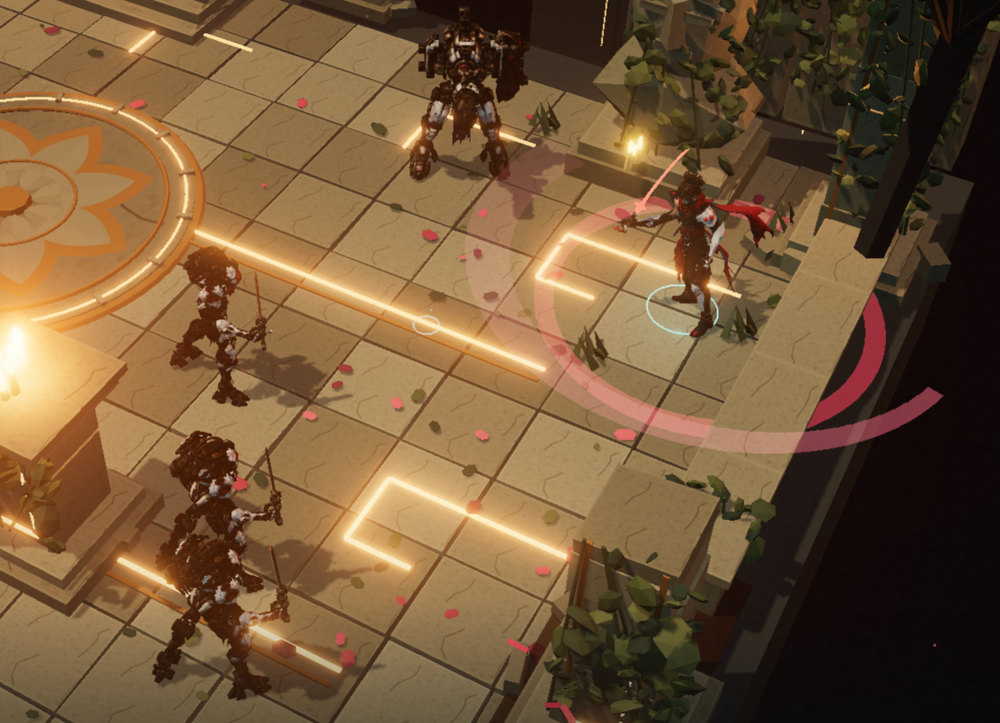
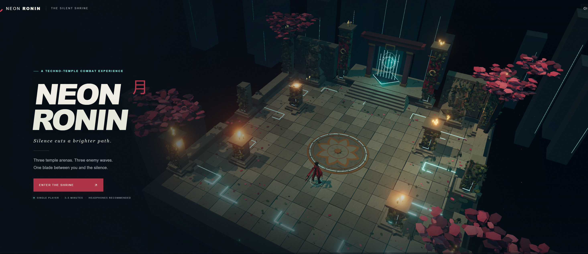

# Neon Ronin

A compact third-person katana combat game set across three ruined techno-temple arenas. Built with React, Vinext, Three.js, and WebGL.



Three escalating waves mix melee drones, ranged sentinels, telegraphed attacks, dodge invulnerability, combo strikes, and a heavy finisher. The camera keeps an elevated isometric style with bounded orbit and zoom. A full encounter takes roughly 3–5 minutes.



## Run locally

Install [Git LFS](https://git-lfs.com/) and Node.js 22.13.0 or newer, then run:

```sh
git lfs install
git clone https://github.com/Tacdelgineer/neon-ronin.git
cd neon-ronin
git lfs pull
npm ci
npm run dev
```

Open the local URL printed by Vinext, normally `http://localhost:3000`. No environment file, account, cloud service, or Blender installation is required. The clone contains the runtime GLBs through Git LFS, and an unset `VITE_ASSET_BASE_URL` loads them from `public/assets/models`.

The title screen should show The Silent Shrine. After selecting **Enter the Shrine**, detailed Forge3D hero and enemy models should replace the simple procedural fallback actors. If only the fallback characters remain, run `git lfs pull` and check the browser console for GLB loading errors.

## Controls

| Input | Action |
| --- | --- |
| WASD | Move relative to the camera |
| Mouse | Aim toward the cursor; left/right edge gives limited elevated orbit |
| Mouse wheel | Zoom in / out within gameplay bounds |
| Q / E | Orbit left / right within the elevated camera range |
| Left click / hold | Chain the three light sword attacks |
| Right click / hold | Heavy finishing slash |
| Space | Dodge in the movement direction, or toward your aim when stationary |
| Escape | Pause / resume |
| Enter | Start or immediately restart after victory / defeat |

## Architecture

The browser UI in `app/page.tsx` creates the Three.js game in `lib/game/engine.js`. The engine owns rendering, camera, input, effects, audio, and scene lifecycle. `lib/game/simulation.js` remains the renderer-independent gameplay authority, while `lib/game/world.js` creates the three arena variants and procedural fallback actors. GLB presentation is split between `player-model.js`, `enemy-model.js`, and `player-animation.js`.

See [AGENTS.md](AGENTS.md) for a file-by-file repository map and safe working rules. The Blender/Forge3D authoring scripts remain under `tools/forge3d-step02`, `tools/forge3d-step03`, and `tools/forge3d-step04`.

## Validate

```sh
npm test
npm run typecheck
npm run build
```

The Node suite covers simulation, collisions, combat, wave completion, real GLB payloads, animation clips, and weapon sockets. The current command reports 23 passing tests.

## Assets and deployment

Local development uses the Git LFS files in `public/assets/models`. Hosted builds can instead set `VITE_ASSET_BASE_URL` so the same runtime paths resolve to Cloudflare R2; R2 is not required for local play. See [R2 asset deployment](docs/DEPLOYMENT.md) for the exact upload set, CORS configuration, and production build behavior.

## Run this project with an AI coding agent

Paste this after cloning, or ask the agent to clone the repository first:

```text
Read README.md and AGENTS.md before changing anything. Verify the declared prerequisites, fetch Git LFS assets, install dependencies with npm ci, and start the existing development server. Fix only setup-related problems if needed. Run npm test, npm run typecheck, and npm run build, then report the local URL and any remaining manual requirement.
```
