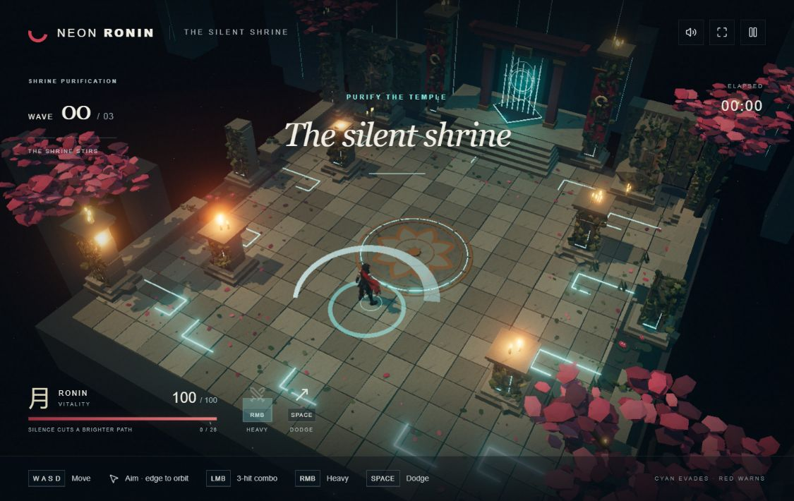

# Step 01 — Forge3D player visual replacement

## Scope

Replace only the visible player character with the supplied Forge3D GLB. The existing controller, hitboxes, controls, camera, arena, enemy visuals and behavior, combat timing, effects, audio, waves, and win/lose logic remain unchanged. No Blender, rigging, retargeting, asset optimization, or additional game features were introduced.

## Original character

- `lib/game/world.js:buildActor('player')` constructs 54 procedural Three.js meshes in a hierarchy of `Group` objects. Shapes include boxes, cylinders, icosahedra, sword geometry, and cloth planes.
- This is not an imported model or a skeletal rig. There are no `SkinnedMesh` objects, bones, skin weights, animation clips, or `AnimationMixer`.
- `animateActor()` rotates arm/leg/torso groups and changes cloth vertices. It also places the root at the controller position and rotates it to the controller's yaw.
- `lib/game/simulation.js` owns movement, attack timing/range/damage, dodge, collision, enemies, and encounter outcomes. Player collision uses the existing radius of `0.43`; it is independent of visible geometry.
- `lib/game/engine.js` owns input, camera, rendering, and effects, and creates/updates the player visual. `lib/game/audio.js` owns sound.
- World convention: Y-up, X/Z ground plane, +Z forward when yaw is zero. Facing uses `atan2(dx, dz)`. The root origin is on the ground between the feet. The legacy root's uniform scale is `1.04`.
- After applying the idle animation at time zero, the old visual spans approximately Y `0.07315` to `2.74927`, including its hair and accessories.

## Supplied GLB inspection

Source filename: `ChatGPT Image Sep 10 2026 03_22_04 PM.glb`.

| Property | Result |
| --- | --- |
| Format | GLB 2.0; exporter metadata identifies trimesh |
| Original byte size | 41,501,728 bytes, approximately 39.58 MiB |
| Scene / mesh nodes | 1 scene, 1 node (`geometry_0`), identity transform |
| Meshes / primitives / materials | 1 / 1 / 1 |
| Vertices | 780,237 |
| Triangles | 981,577, indexed with 2,944,731 unsigned 32-bit indices |
| Skeleton / skins | None |
| Animation clips | None |
| Vertex attributes | Position, normal, UV; no joint or weight attributes |
| Textures | 2 embedded WebP images, both 4096 × 4096 |
| Texture 0 | RGBA base color; 3,356,544 encoded bytes; sRGB |
| Texture 1 | RGB packed metallic/roughness; 1,396,852 encoded bytes; non-color data |
| PBR material | Metallic/roughness workflow; factors 1 / 1, texture maps preserved, opaque, single-sided |
| Normal / emissive maps | None; mesh supplies vertex normals |
| Required extension | `EXT_texture_webp`, supported by the installed Three.js GLTFLoader |
| Source bounds minimum | `(-0.31264663, -0.50083935, -0.18560249)` |
| Source bounds maximum | `(0.31338167, 0.50081593, 0.17066550)` |
| Source dimensions | `(0.62602830, 1.00165528, 0.35626799)` |
| Current transform scale | `(1, 1, 1)`; approximately one source unit tall; no reliable physical-size calibration supplied |
| Orientation | Y-up, face toward +Z, confirmed in front/back/side renders |
| Origin / pivot | `(0, 0, 0)`, near the model's overall center, not its feet |
| Pose | Static standing character with fixed cloth and sheathed sword |

The source GLB was copied byte-for-byte to:

`public/assets/models/neon-ronin-forge3d.glb`

Runtime URL: `/assets/models/neon-ronin-forge3d.glb`. Runtime code never references Downloads or an absolute filesystem path.

SHA-256, verified against the supplied file:

`fa5d87a1fd477b8b95aa3fa0f68e712c3f20498baaf6dd4baa62fa2ffafb3cbd`

## Exact integration approach

`lib/game/player-model.js` uses `GLTFLoader` from the project's already installed Three.js package. There was no prior GLB loader in this game; no new runtime or dependency was installed.

The loaded scene is wrapped in a visual-only `Group` and attached as a sibling of the old procedural body under the existing player root. Only after successful loading is `player.body.visible` set to false. The original `animateActor()` and all controller logic continue unchanged. The new model follows root translation, yaw, existing root scale, and the existing 0.05-unit dodge lift as one whole object. Its limbs and cloth do not animate.

The original body remains available during loading or if loading fails. Loading failure is logged and leaves the game playable with its previous visual. Restart reuses the loaded model. Disposal releases the imported geometry, material, both textures, and image bitmaps; a load completing after game disposal is also cleaned up.

All imported meshes cast and receive shadows. GLTFLoader handles the material's PBR properties and texture color spaces; no recoloring, material replacement, new light, camera adjustment, or texture conversion is applied.

### Tuning constants

Only the three requested model-adjustment constants are introduced, in `lib/game/player-model.js`:

| Constant | Value | Purpose |
| --- | --- | --- |
| `PLAYER_MODEL_SCALE` | `2.6` | Uniform local scale; with the existing root scale, effective scale is `2.704` |
| `PLAYER_MODEL_Y_OFFSET` | `1.3021823167800903` | `-sourceMinY × 2.6`; places the lowest vertices at Y=0 |
| `PLAYER_MODEL_ROTATION_Y` | `0` | Source +Z already matches gameplay forward |

The integrated model is approximately `2.70848` world units high. No change to camera framing was needed. Scale and offsets are visual-only; collision, sword reach, attack cones, and projectile tests still use the existing simulation values.

## Validation and known-good behavior

Completed before committing:

| Check | Result |
| --- | --- |
| Existing gameplay suite | PASS, 9 tests, unchanged |
| Model integration suite | PASS, 3 tests: original asset integrity/properties; public loader URL, scale/grounding/shadows/PBR preservation/disposal; load failure propagation |
| TypeScript | PASS, `npx tsc --noEmit --incremental false` |
| Production build | PASS, `npm run build`; asset included in client output |
| Game starts / GLB loads | PASS, model-ready marker observed; no GLB loading errors |
| Visible character / scale / forward / feet | PASS, inspected in source four-view render and actual game |
| Movement / facing | PASS, keyboard movement and mouse-facing observed with imported character |
| Camera | PASS, original elevated follow and mouse-edge orbit exercised |
| Light attacks / hit detection | PASS, first wave cleared in browser with 3 kills and a 24-hit chain |
| Heavy attack | PASS, original heavy slash effect and cooldown observed; screenshot below |
| Dodge | PASS, movement burst and existing streak/recovery observed |
| Pause / restart | PASS, game resumed/restarted and the loaded Forge3D visual remained attached |
| Enemies | PASS, original drone visuals/attacks observed; all enemy implementation and wave logic unchanged |
| Console | No game GLB, texture, material, or runtime errors during checks |

The initial temporary four-view inspection page produced a duplicate-Three.js warning due to its isolated import map. That temporary page was removed; the actual game uses the normal single Three.js dependency and did not introduce that warning.

The original full encounter simulation still ends in victory at 145.6 simulation seconds, with 26 kills and 59 vitality, matching the pre-change baseline. This is a controller regression check, not a new complete manual playthrough.

The existing idle diagnostics reported a rounded frame time of 4 ms both before and after at the same 1280 × 720 browser size. This is a coarse, refresh-limited observation, not a controlled average-FPS benchmark; no measurable slowdown appeared in those samples. No simplification or recompression was justified or performed.

Byte hashes for `simulation.js`, `world.js`, `audio.js`, `app/page.tsx`, and `app/globals.css` match the pre-change baseline. The only edits to existing game code are the player model import/load/attachment and its disposal in `engine.js`.

Run regression checks:

```sh
npm test
node --test lib/game/player-model.test.js
npx tsc --noEmit --incremental false
npm run build
```

### Manual follow-up

1. Run `npm run dev`, open the printed local URL, and enter the shrine.
2. Confirm the red scarf, armor, and standing pose match the supplied asset, with feet at ground level.
3. Move with WASD, aim with the mouse, and orbit from either horizontal edge.
4. Use left-click combos, right-click heavy, and Space dodge near enemies. Hits and cooldowns should behave as before.
5. Pause/resume and restart; confirm the GLB remains attached and visible.
6. Check the browser console for GLB or texture errors.

## Limitations and next-step boundary

- This GLB is unrigged. The previous procedural arm/leg/cloth animation does not automatically transfer to it.
- Movement is a static pose sliding/rotating as a whole; attacks do not animate the arms or unsheathe the modeled sword. Existing slash effects, dash effects, sound, timing, and hitboxes still operate.
- The source contains nearly one million triangles and two 4K textures. Its bytes are unchanged, so first-load transfer cost remains approximately 41.5 MB.
- The procedural player can be visible briefly while the GLB loads; it remains the fallback if the asset cannot load.
- Blender is not needed for this milestone. A future articulated walk/attack/dodge animation milestone would need a rigged/skinned asset and suitable animations (or a deliberate rigging workflow). Blender is one possible tool, not a requirement. No rigging or next-stage work was performed.
- This milestone ends at a tested local commit. No source push or deployment is included; the previously published Site remains unchanged.


